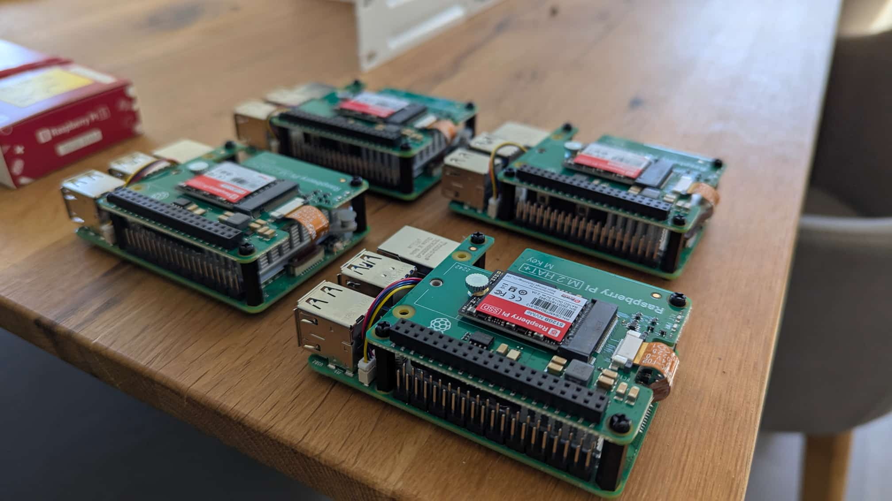
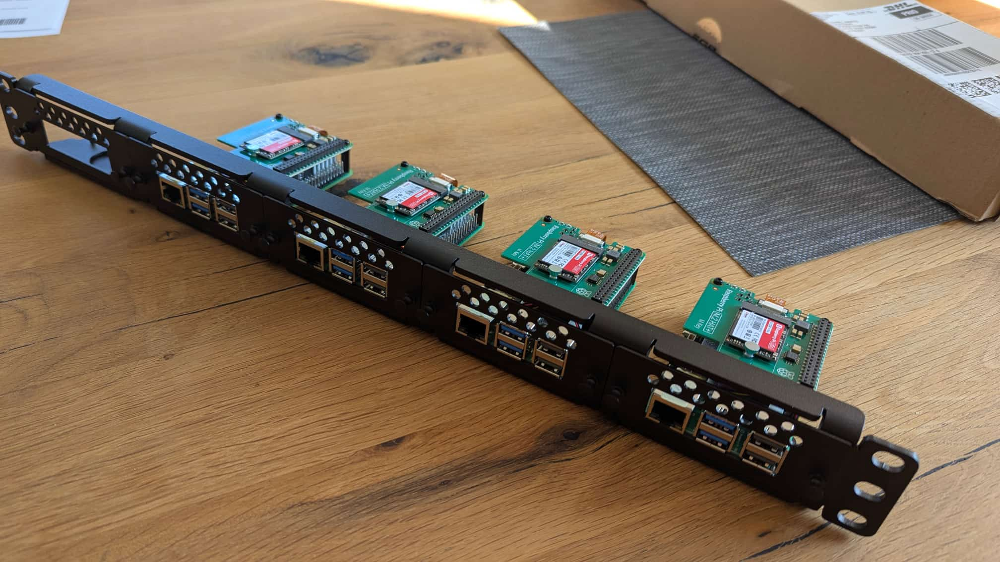
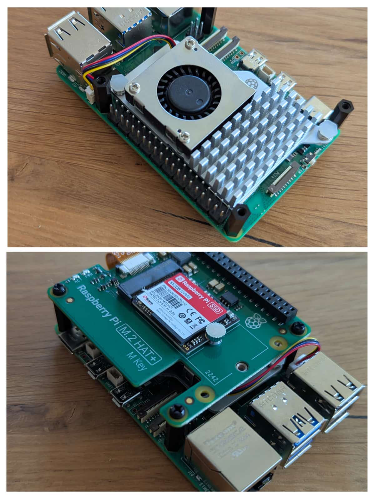

# Home Lab K3s Cluster – Raspberry Pi 5 Edition

Welcome to my home lab Kubernetes project!  
This setup runs a full-featured [K3s](https://k3s.io/) cluster on **Raspberry Pi 5 hardware**, designed for experimentation, learning, and real-world edge infrastructure.

> _This repository documents the architecture, configuration, and tooling of my personal Kubernetes cluster._

---

## Hardware Overview

- **4 × Raspberry Pi 5**
  - 16 GB RAM each
  - 512 GB NVMe SSD via PCIe
  - Active cooling (fan-based)
  - USB-C powered
- **1 × Managed Switch**
- **1 × Dedicated Router with BGP Support**
- Gigabit LAN per node

  
  
  

---

## Architecture

The cluster uses [K3s](https://k3s.io/) for a lightweight Kubernetes control plane, tailored to ARM64 and edge use.

Key components:

- 🔹 **K3s**: Lightweight Kubernetes distro (HA optional)
- 🔹 **Ceph**: Highly available, distributed block storage
- 🔹 **MetalLB**: Bare-metal LoadBalancer integration
- 🔹 **BGP**: MetalLB paired with BGP announcements for IP routing
- 🔹 **Helmfile**: Declarative application and infrastructure deployments

_📸 Diagrams and schematics will be added soon._

---

## Storage Layer

A dedicated **Ceph cluster** provides persistent storage across all nodes:

- RBD (block) volumes for apps
- StorageClass integration with Kubernetes
- Performance tuned for NVMe and ARM64

---

## Networking & Load Balancing

To expose services externally, the cluster uses:

- [**MetalLB**](https://metallb.universe.tf/) with BGP
- Public and internal IP address pools
- BGP peering with local router for routed LoadBalancers

---

## Configuration Management

All apps and infrastructure components are managed declaratively using [**Helmfile**](https://github.com/helmfile/helmfile):

- Organized per chart in `charts/`
- Secrets handled externally (SOPS or manually excluded)
- GitOps-friendly layout with environments

---

## What This Repo Is (and Isn’t)

✅ This repository is:

- A reference and documentation source
- A showcase of a real K3s-on-ARM setup
- A base for further experiments and improvements

❌ This repository is not:

- Meant for direct copy-paste deployments
- A production-grade solution out-of-the-box
- A one-size-fits-all template

---

## 🖼 Planned Visuals

Coming soon:

- Cluster topology diagram
- Storage flow overview (Ceph + K8s PVC)
- Load balancer/IP flow map (MetalLB + BGP)
